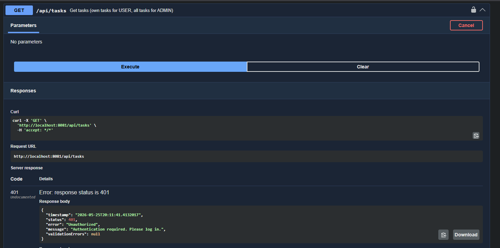
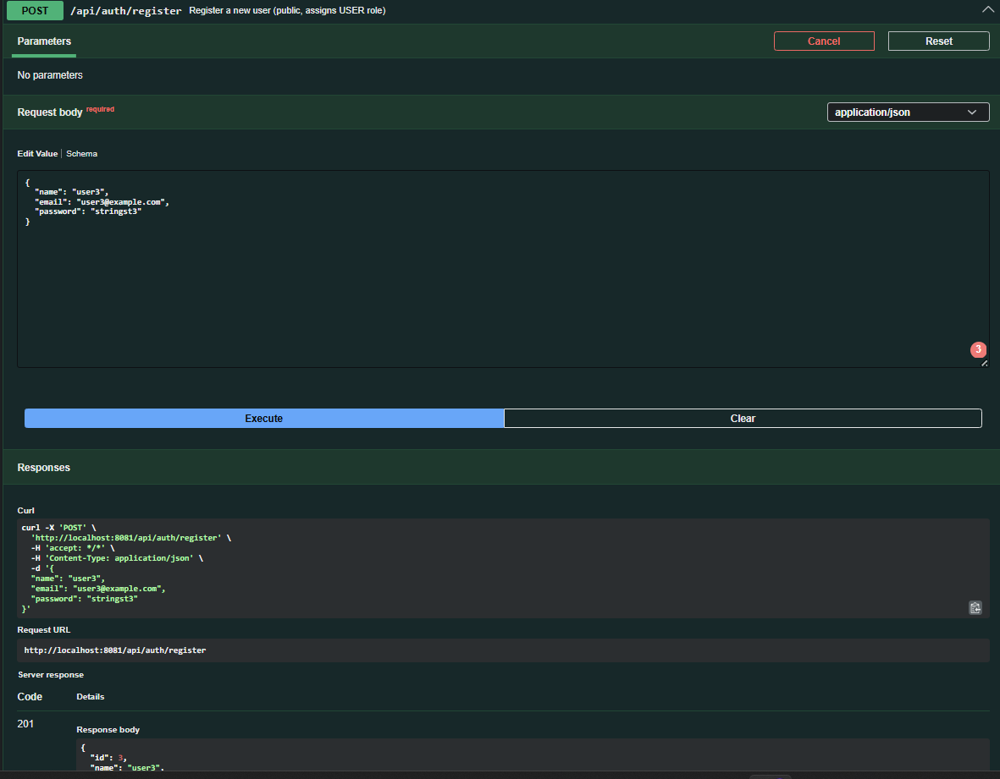
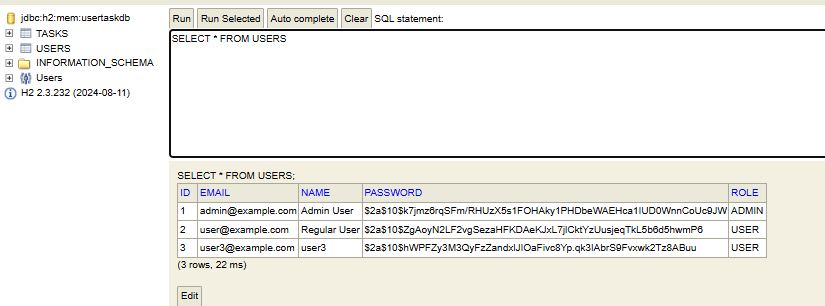
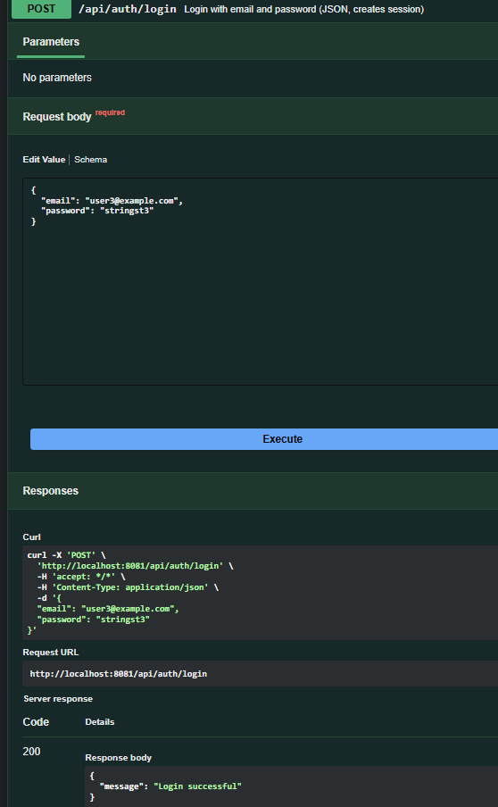
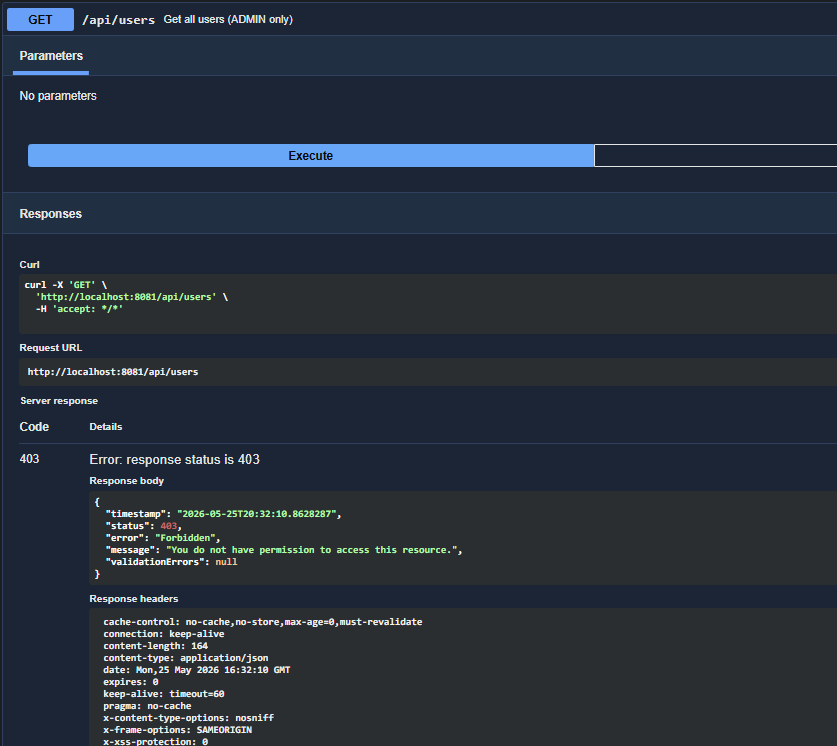
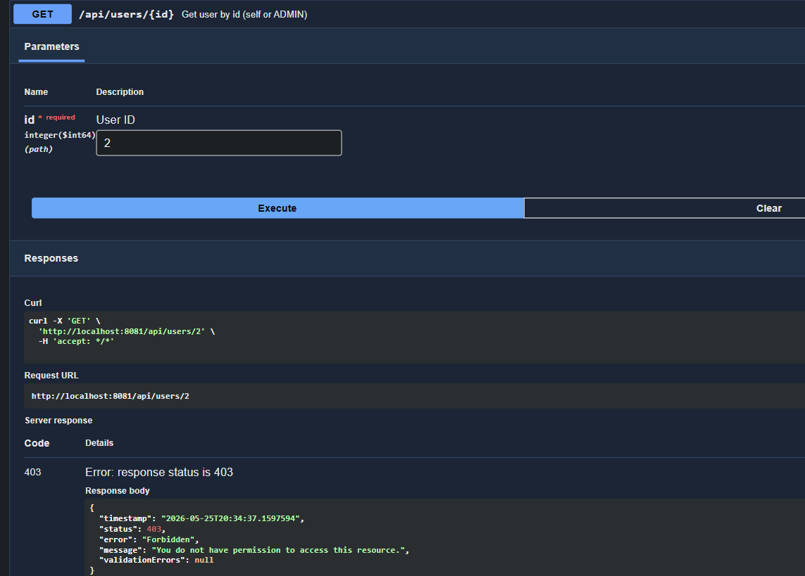
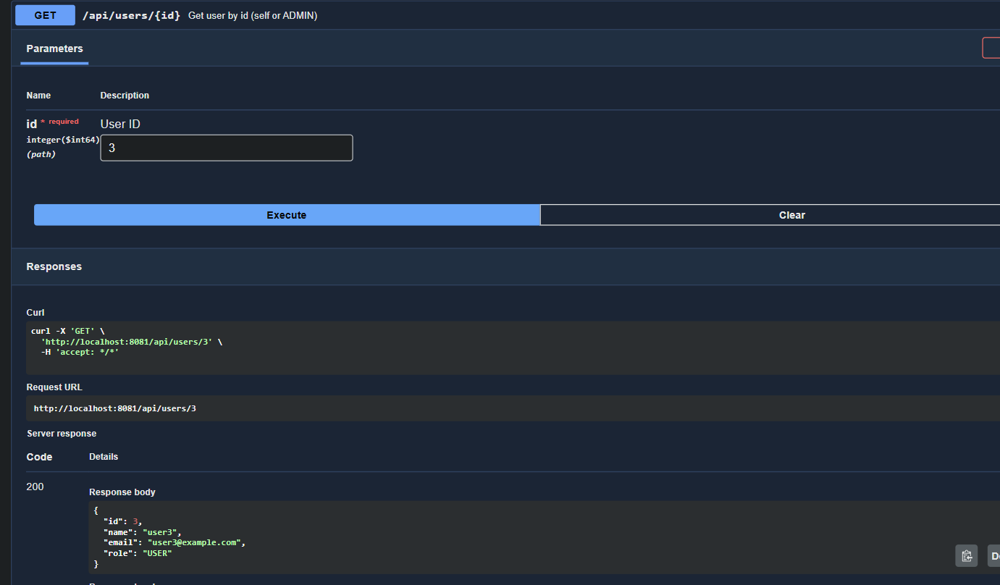
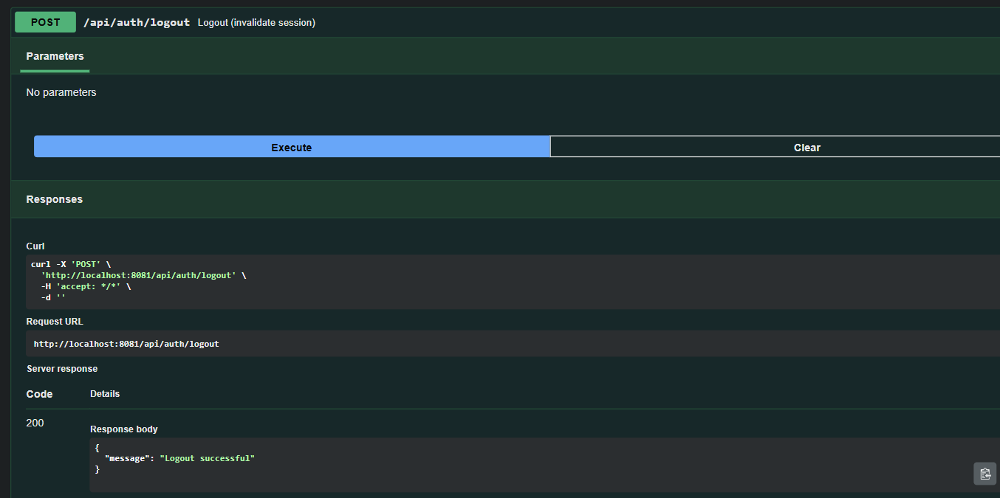
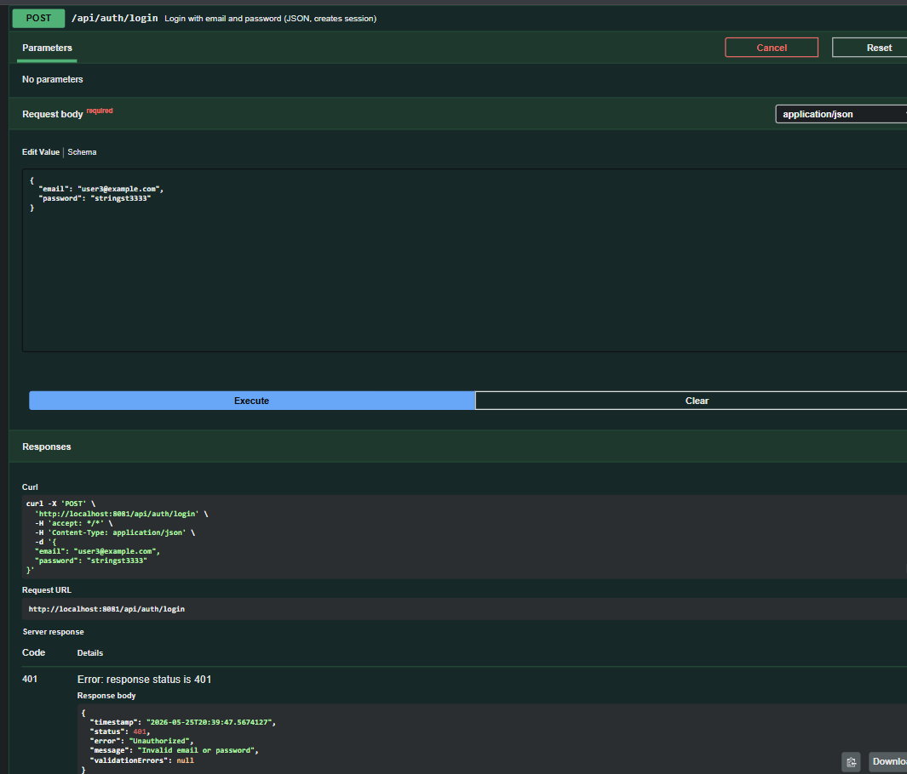
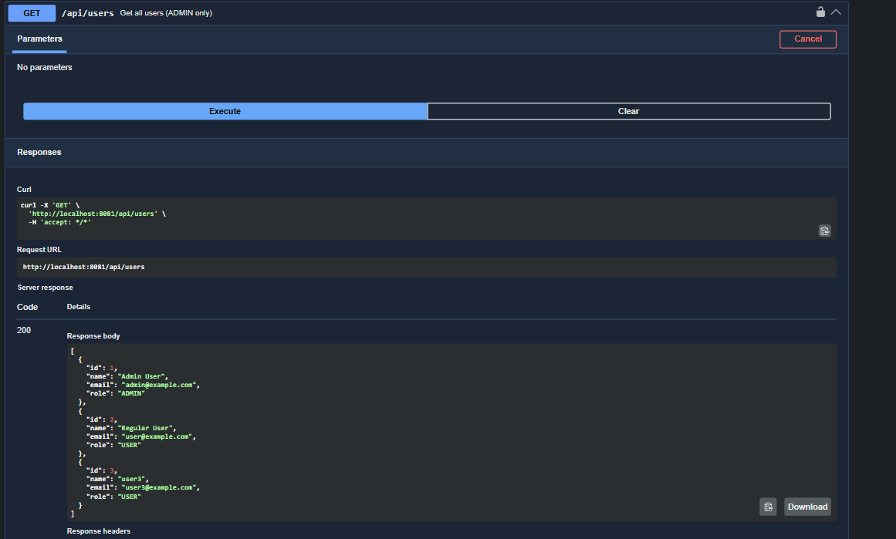

# User Task API

Spring Boot REST API for managing users and their tasks. Uses Spring Security with roles and BCrypt passwords.

## Tech stack

- Java 21
- Spring Boot 3
- Spring Web
- Spring Data JPA (Hibernate)
- Spring Security (HTTP Basic + JSON login, BCrypt, method security)
- H2 Database
- Bean Validation
- SpringDoc OpenAPI (Swagger)
- Lombok

## Project structure

Layered architecture:

- `controller` - REST endpoints
- `service` - business logic
- `repository` - data access
- `entity` - JPA entities
- `dto` - request/response models
- `exception` - global error handling
- `config` - Security, OpenAPI, seed data
- `security` - UserDetails, REST 401/403 handlers

## Data model

- `User` (id, name, email, password, role)
- `Task` (id, title, description, status, user)
- One user has many tasks (`OneToMany` / `ManyToOne`)
- Roles: `USER`, `ADMIN`

## How to run

1. Open the project in IntelliJ or Cursor.
2. Run `UserTaskApiApplication`.
3. Application starts on http://localhost:8081.

## Useful URLs

- Swagger UI: http://localhost:8081/swagger-ui.html
- H2 Console: http://localhost:8081/h2-console

H2 login values:

- JDBC URL: `jdbc:h2:mem:usertaskdb`
- Username: `sa`
- Password: *(empty)*

---

## Security

### Login credentials (seeded on startup)

| Email               | Password   | Role  |
| ------------------- | ---------- | ----- |
| `admin@example.com` | `admin123` | ADMIN |
| `user@example.com`  | `user123`  | USER  |

New accounts can be created via `POST /api/auth/register`. They always get the `USER` role.

Passwords are stored using BCrypt (`BCryptPasswordEncoder`).

### Login and logout

**Option A: JSON login in Swagger**

1. Open `POST /api/auth/login`, click Try it out.
2. Request body:

```json
{
  "email": "user@example.com",
  "password": "user123"
}
```

3. Execute. You should get 200 and `"Login successful"`.
4. Then call `GET /api/auth/me` or any task endpoint in the same tab.

**Option B: HTTP Basic in Swagger**

1. Click Authorize (lock icon).
2. Username is the full email (`user@example.com`).
3. Password is the account password (`user123`).
4. Click Authorize, then Close.
5. If the browser shows its own popup, click Cancel and use only Swagger's Authorize dialog.

**Logout**

```http
POST /api/auth/logout
```

Use the same browser tab so the session cookie is sent.

### User roles

| Role    | Description                                       |
| ------- | ------------------------------------------------- |
| `USER`  | Can manage own tasks and own profile only         |
| `ADMIN` | Can manage all users, all profiles, and all tasks |

### Endpoint access rules

| Endpoint                                     | Access                                       |
| -------------------------------------------- | -------------------------------------------- |
| `POST /api/auth/register`                    | Public                                       |
| `POST /api/auth/login`                       | Public                                       |
| `POST /api/auth/logout`                      | Authenticated                                |
| `GET /api/auth/me`                           | Authenticated                                |
| `POST /api/tasks`                            | Authenticated (owner = current user)         |
| `GET /api/tasks`                             | Authenticated (USER: own tasks; ADMIN: all)  |
| `GET/PUT/DELETE /api/tasks/{id}`             | Task owner or ADMIN                          |
| `GET /api/users/{id}`, `PUT /api/users/{id}` | Self or ADMIN                                |
| `GET /api/users`                             | ADMIN only                                   |
| `POST /api/users`                            | ADMIN only                                   |
| `DELETE /api/users/{id}`                     | ADMIN only                                   |
| Swagger UI, H2 console, OpenAPI docs         | Public                                       |

### ADMIN-only functionality

- List all users (`GET /api/users`)
- Create users with a chosen role (`POST /api/users`)
- Delete users (`DELETE /api/users/{id}`)
- Checked at URL level in `SecurityConfig` and at method level with `@PreAuthorize("hasRole('ADMIN')")` on `UserServiceImpl`.

### Authenticated-only functionality

- All task CRUD under `/api/tasks/**`
- Current user profile: `GET /api/auth/me`
- Checked at URL level and with `@PreAuthorize("isAuthenticated()")` on task service methods and `AuthServiceImpl.getCurrentUser()`.

### Method security (`@PreAuthorize`)

Enabled via `@EnableMethodSecurity` in `SecurityConfig`. Examples:

- `@PreAuthorize("hasRole('ADMIN')")` on `UserServiceImpl.create`, `findAll`, `delete`
- `@PreAuthorize("isAuthenticated()")` on `TaskServiceImpl` methods and `AuthServiceImpl.getCurrentUser()`

### CSRF

CSRF is disabled in `SecurityConfig`. This is a REST API used through Swagger and Postman, not browser HTML forms, so CSRF tokens are not needed here. If HTML forms are added later, CSRF should be enabled again.

---

## Main endpoints

### Authentication

- `POST /api/auth/register` - public registration
- `POST /api/auth/login` - JSON login
- `POST /api/auth/logout` - logout
- `GET /api/auth/me` - current user profile

### Users

- `POST /api/users` - ADMIN only
- `GET /api/users` - ADMIN only
- `GET /api/users/{id}` - self or ADMIN
- `PUT /api/users/{id}` - self or ADMIN (partial updates supported)
- `DELETE /api/users/{id}` - ADMIN only

### Tasks

- `POST /api/tasks` - authenticated, owner set to current user
- `GET /api/tasks` - USER sees own tasks, ADMIN sees all
- `GET /api/tasks/{id}` - task owner or ADMIN
- `PUT /api/tasks/{id}` - task owner or ADMIN
- `DELETE /api/tasks/{id}` - task owner or ADMIN

## Notes

- Validation is applied on request DTOs.
- API returns proper error responses (400, 401, 403, 404, 409, 500).
- Entities are never returned directly (only DTOs).
- Passwords are never returned in API responses.

## Screenshots

Unauthenticated `GET /api/tasks` returns 401:


User registration:


Hashed passwords in the database:


Successful login:


USER trying to list all users (forbidden by business logic):


USER trying to access another user's profile returns 403:


USER accessing own profile (allowed):


Logout:


Login with wrong password returns 401:


ADMIN calling `GET /api/users` returns 200:
